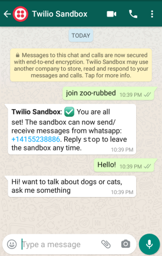
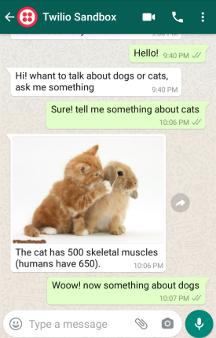
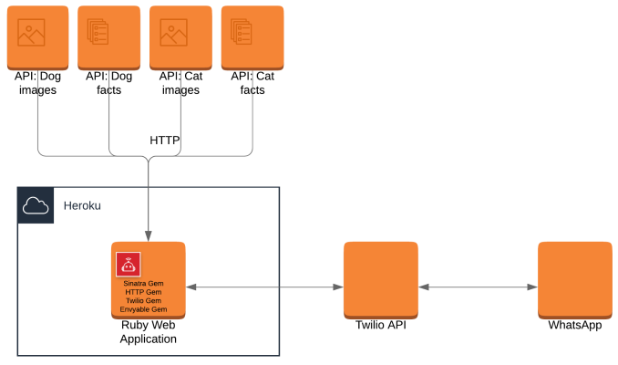
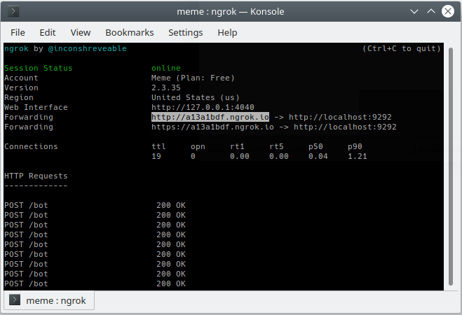
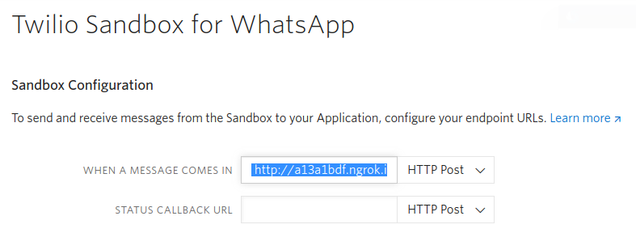

# WhatsApp Chatbot

> Web service using Sinatra, a framework of Ruby

The project is about a chatbot through WhatsApp using Ruby.



## Built With

- Ruby
- Sinatra framework

## Trying the chatbot

**This is a guide about how to use the bot**

### Prerequisites

You have to have the WhatsApp application installed on your phone.

### Usage

If you want to try the bot, follow the next steps:

- Add the next number to your contacts: +1 415 523 8886.
- Open WhatsApp.
- Send "join zoo-rubbed" without quotes to start the communication.
- Say "Hello!".
- Keep sending messages asking about dogs, cats, foxes and owls.



The chat just knows about dogs, cats, foxes and owls, try to speak about something else and see what will happen.

Reply "stop" without quotes at any time when you want to stop interacting with the chatbot.

### Understandign the project

This project works online, to do that there are three main components:

* This web project, using Sinatra. [Sinatra](http://sinatrarb.com/) is a DSL for quickly creating web applications in Ruby.
* [Twilio](https://www.twilio.com/), an API that allows the web application to communicate with WhatsApp
* [Heroku](https://www.heroku.com/), is a platform as a service (PaaS) that enables developers to build, run, and operate applications entirely in the cloud. Here is where I published this web application.

For Twilio and Heroku you must create an account for each to manage your sandbox in Twilio and your projects in Heroku.



## Set-Up Locally

**This is a guide about how to set-up the project locally in your computer**

### Prerequisites

- Clone this project
- Download [ngrock](https://ngrok.com/download) using the steps on the page. Ngrok allows you to open a tunnel for your application to interact with Twilio, a public address will be mapped to your local computer.
- Create an account in [Twilio](https://www.twilio.com/) and set-up a sandbox for WhatsApp. Twilio will guide you in setting-up your WhatsApp sandbox when you create your account, if not, there is a [guide](https://www.twilio.com/whatsapp).

### Setting-up

First, install all the gems used in this project with the next instruction:

```
$ bundle install
```

Set your own Twilio auth [token](https://www.twilio.com/console) in the /config/env.yml file in the only one TWILIO_AUTH_TOKEN variable.

Start ngrok, you have to be in the same folder in which you unzipped ngrok, it will enable a tunnel. Use a port that you know is free, below I use 9292:

```
$ ./ngrok http 9292
```

In another terminal run the web application, you must be in the root of the project.

```
$ bundle exec rackup config.ru
```

When you run ngrok you can see an URL, that is the output of your web application to the Internet.



In your Twilio [Sandbox](https://www.twilio.com/console/sms/whatsapp/sandbox) use that to set the URL endpoint to receive messages in your web application, don't forget to add '/bot' at the end of your URL.



In your Twilio [Learn](https://www.twilio.com/console/sms/whatsapp/learn), you will see the number assigned to you to interact with WhatsApp using your cell phone and sending a code that you have to use to start the interaction.

That's all, you can interact with this chatbot from your local machine.

## Test Instructions

To run all test cases, you must be in the root directory of the project and run:

```
$ rspec
```

If you want to execute a specific file, always in the root directory of the project, you must execute something like the next:

```
$ rspec ./spec/fox_spec.rb
```

## Author

👤 **Manuel**

- Github: [@meme-es](https://github.com/meme-es)
- Twitter: [@meme_es](https://twitter.com/meme_es)
- Linkedin: [linkedin](https://www.linkedin.com/in/manuel-elias-b289a638/)

## 🤝 Contributing

Contributions, issues and feature requests are welcome!

Feel free to check the [issues page](https://github.com/meme-es/whatsapp-bot/issues).

## Show your support

Give a ⭐️ if you like this project!

## 📝 License

This project is without a license.
